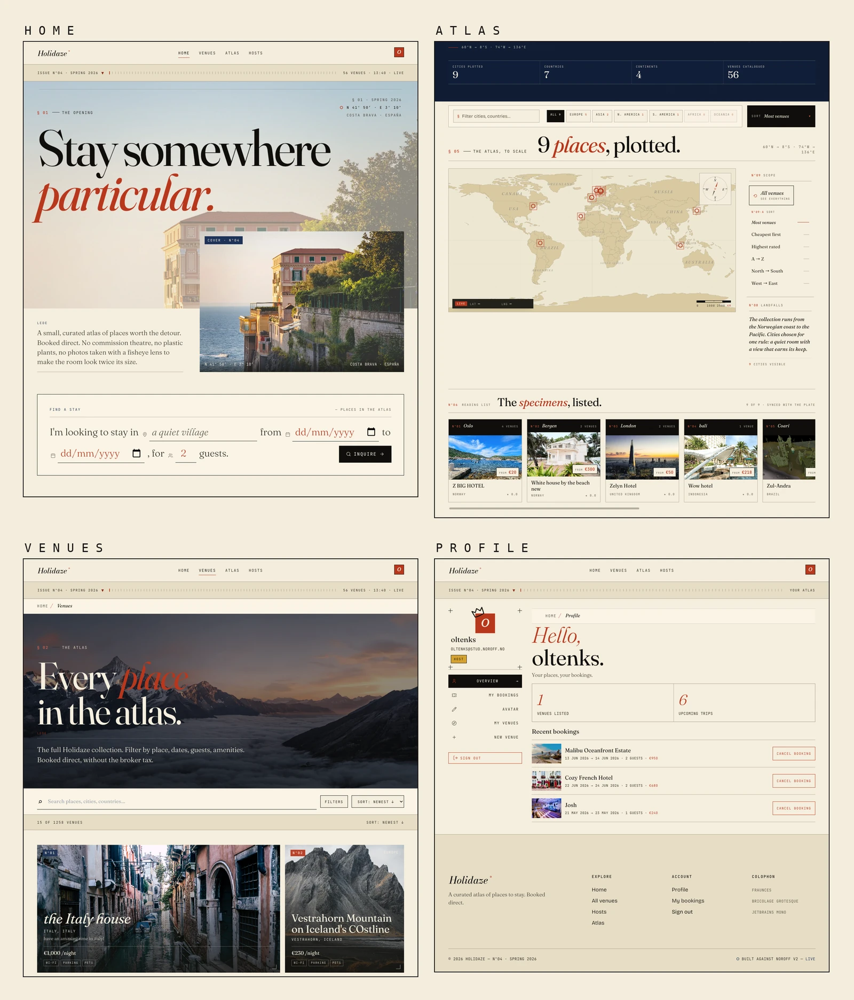
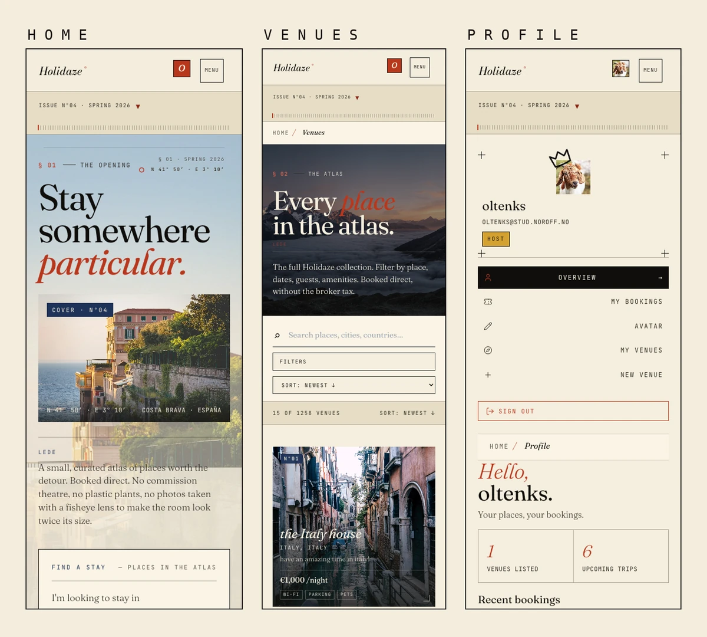

# Holidaze

[](https://github.com/sergiu-sa/holidaze_pe/actions/workflows/ci.yml)
[](https://holidaze-black.vercel.app/)

A modern front end for **Holidaze**, an accommodation booking site built against the Noroff API v2. Three audiences: guests, customers, venue managers, and all share one editorial magazine reading experience: a printed-page hero, a calendar that doubles as a layout grid, and a venue card that reads as a contact-sheet specimen.

- **Guests** browse and search venues, view details and availability calendars, and register an account.
- **Customers** book stays, view their upcoming bookings, and manage their profile.
- **Venue Managers** create, edit, and delete venues, and track bookings on venues they own.

## Screenshots

**Desktop:** home, atlas, venues, profile.


**Mobile:** home, venues, profile.


## Stack

| Layer | Choice |
| --- | --- |
| Language | TypeScript (strict mode) |
| Framework | React 18 |
| Routing | React Router v6 |
| Styling | Tailwind v3 + CSS variables for runtime tokens |
| Bundler | Vite |
| Server state | Hand-rolled hooks on top of native `fetch` |
| Validation | Zod at every API boundary |
| Forms | Native `<form>` + `safeParse` validators |
| Tests | Vitest + React Testing Library (unit / integration); Playwright (end-to-end, three browsers) |
| Lint / format | ESLint flat config + Prettier, zero-warning gate |
| Hosting | Vercel |
| API | `https://v2.api.noroff.dev/holidaze` |

## Folder structure

Feature-grouped under `src/`. Components live next to the area they belong to; shared primitives in `ui/`; hooks, pure helpers, and types each get their own root.

```md
holidaze/
├── .github/                     # GitHub Actions CI workflow
├── e2e/                         # Playwright end-to-end specs
├── public/                      # static assets served at the root URL
├── screenshots/                 # README screenshots
├── docs/                        # brand.md + scope-inventory.md (other docs are local-only)
├── src/
│   ├── api/                     # fetch wrapper + feature modules (auth, venues, bookings, profiles)
│   ├── assets/                  # bundled images (hero covers, logos)
│   ├── components/              # UI grouped by area
│   │   ├── atlas/               # typographic world-map plate
│   │   ├── auth/                # LoginForm, RegisterForm, guards, modals
│   │   ├── booking/             # BookingPanel, AvailabilityCalendar, Receipt
│   │   ├── browse/              # VenueCard, VenueGrid, search, filters
│   │   ├── hosts/               # /hosts editorial spread
│   │   ├── intro/               # first-visit IntroCover overlay
│   │   ├── manager/             # VenueForm, AmenityToggle, ImageUrlList
│   │   ├── nav/                 # PrimaryNav, AvatarMenu
│   │   ├── profile/             # ProfileSidebar, BookingList, AvatarEditor
│   │   ├── shell/               # AppLayout, Topbar, Footer, Ruler
│   │   ├── ui/                  # Button, Field, Chip, ConfirmDialog, ToastProvider
│   │   └── venue/               # VenueSpread, VenueGallery, AmenityList
│   ├── hooks/                   # useAuth, useVenues, useBookings, useProfile, …
│   ├── lib/                     # pure helpers (isUsable, dates, atlas, hero rotation)
│   ├── pages/                   # route-level components (thin; compose from components/)
│   ├── routes/                  # React Router config + lazy chunks
│   ├── styles/                  # global.css + per-surface partials
│   ├── test/                    # MSW handlers + Vitest fixtures
│   └── types/                   # Venue, Booking, Profile, ApiError
├── AI_LOG.md
├── README.md
├── package.json
├── vite.config.ts
├── tailwind.config.ts
├── eslint.config.js
├── tsconfig.json
├── playwright.config.ts
└── vercel.json
```

## Tech and design decisions

A few choices worth naming up front.

- **No state library.** TanStack Query was on the shortlist but the project scope is small enough that a thin `useResource` hook on top of `fetch` (with sessionStorage cache + abort-on-stale) gives us the same UX without the dependency. Each feature owns its own hook (`useVenues`, `useVenue`, `useBookings`, `useProfile`).
- **Zod at the fetch boundary.** Every Noroff response is `safeParse`'d before it reaches a component. Schemas double as the source of truth for our TypeScript types via `z.infer`. The same pattern guards `localStorage` reads a tampered session payload is rejected and the slot is cleared rather than silently flowing into auth headers.
- **Editorial brutalism is load-bearing.** No `border-radius` anywhere (ESLint blocks it; a global CSS reset enforces it). Three typefaces (Fraunces / Bricolage Grotesque / JetBrains Mono), each with a fixed job. Cinnabar / lapis / saffron used as accents, never as the main canvas.
- **Accessibility floor: WCAG 2.1 AA.** Every interactive element has a `focus-visible` 2px cinnabar outline. Calendars use real `<button>`s with descriptive `aria-label`s. `prefers-reduced-motion` collapses every transition. The dialog primitive is native `<dialog>` for focus trapping and Esc-to-close.
- **Three-step Noroff auth bootstrap.** `register` → `login` → `createApiKey`, persisted as one session blob. Both `Authorization` and `X-Noroff-API-Key` headers are required on every protected request and injected centrally by the fetch wrapper.

## Local development

```bash
git clone https://github.com/sergiu-sa/holidaze_pe.git
cd holidaze_pe
npm install
npm run dev          # vite dev server, localhost:5173
npm run build        # production bundle into dist/
npm run preview      # serve the production bundle locally, localhost:4173
npm run lint         # eslint, zero-warning gate
npm run typecheck    # tsc --noEmit
npm run test         # vitest (unit / integration)
npm run e2e          # playwright (end-to-end, three browsers)
```

## Environment variables

**None required.** The Noroff API base URL is public and constant, so it is hardcoded in `src/api/client.ts`. Authentication is per user, not per app: the access token and API key are issued at login through the Noroff `register`, `login` and `create-api-key` flow, and stored in `localStorage` (cleared on logout), so there is nothing to put in a `.env` file.

## Deployment

Hosted on Vercel with autodeploys on push to `main`. The live build is at [holidaze-black.vercel.app](https://holidaze-black.vercel.app/). `vercel.json` sets `X-Frame-Options: DENY`, `X-Content-Type-Options: nosniff`, `Referrer-Policy`, and `Permissions-Policy` headers.

## Lighthouse

Run against the deployed Vercel build in incognito Chrome with no extensions enabled. Desktop mode values shown; mobile-mode Accessibility is identical (100 / 100 / 97 / 100 / 100), Performance varies by route as expected under mobile throttling.

| Route          | Performance | Accessibility | Best Practices | SEO |
|----------------|-------------|---------------|----------------|-----|
| `/`            | 100         | **100**       | 96             | 92  |
| `/venues`      | 95          | **100**       | 100            | 92  |
| `/venues/:id`  | 96          | **97**        | 100            | 92  |
| `/atlas`       | 98          | **100**       | 92             | 92  |
| `/profile`     | 100         | **100**       | 100            | 92  |

Accessibility passes the WCAG 2.1 AA floor on every route. Performance variance on mobile is driven by Noroff dataset venue images served from external CDNs (Imgur, postimg, live-website) outside of project control. Profile mobile Performance is unscored because Lighthouse cannot detect an LCP-eligible element on a small text-heavy page.

WAVE shows zero red errors across the five routes. The remaining WAVE contrast flags are false positives on `aria-hidden="true"` decorative typography (Atlas TERRA watermark) and on `.sr-only` screen-reader-only live regions, both correctly hidden from sighted users by design.

## Design

- [Figma Style Guide](https://www.figma.com/design/6b7xOMQl4yOkBZMJXQ9kNo/Holidaze%C2%B0?node-id=111-3227)
- [Figma Design (hi-fi, desktop + mobile)](https://www.figma.com/design/6b7xOMQl4yOkBZMJXQ9kNo/Holidaze%C2%B0?node-id=246-4769)
- [Figma Lo-fi wireframes (desktop + mobile)](https://www.figma.com/design/6b7xOMQl4yOkBZMJXQ9kNo/Holidaze%C2%B0?node-id=170-682)

## Links

- [Live site](https://holidaze-black.vercel.app/)
- [GitHub repo](https://github.com/sergiu-sa/holidaze_pe)
- [Kanban board](https://github.com/users/sergiu-sa/projects/14/views/2)
- [Roadmap (Gantt view)](https://github.com/users/sergiu-sa/projects/14/views/4)

### Licence

The code is released under the [MIT License](LICENSE). The artworks shown are not mine to license: they reach the site through the shared Noroff Artworks API and belong to their respective owners.